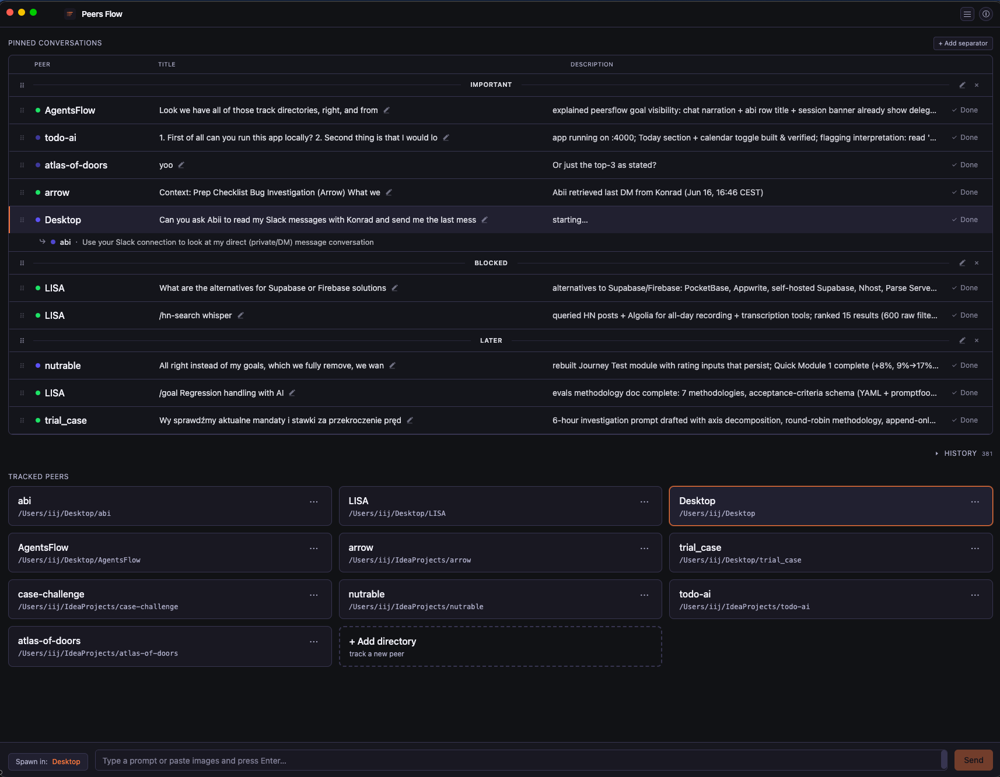
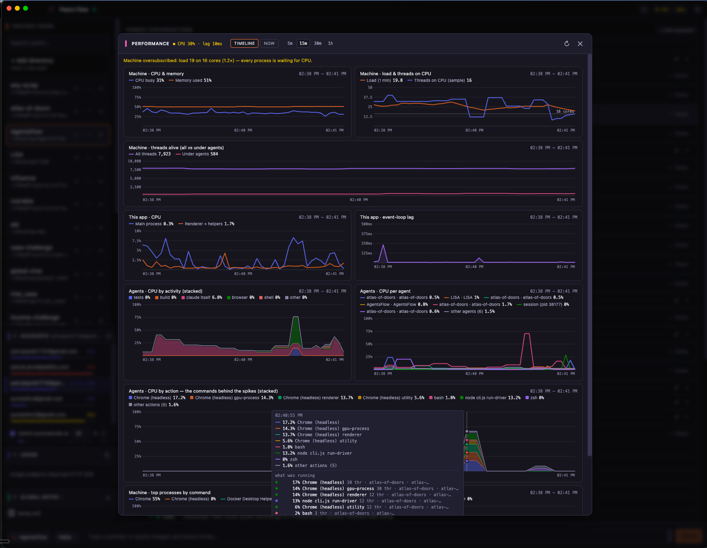

# Peers Flow



Electron + Next.js desktop UI for **Claude Code's background agents** — track the sessions this app launches, treat them like a to-do list, inspect each one's working tree without leaving the window, and let your agents **delegate work to one another across directories**.

> Status: early. Built against Claude Code CLI **v2.1.139+** (`claude agents` / `claude --bg`).

## Why

Built to scratch four specific itches working with Claude Code day-to-day:

1. **Agent management in the CLI is ugly.** `claude agents` is functional but unpleasant to live in — no real overview, no pinning, no per-directory grouping. Peers Flow turns background sessions into a visual to-do list scoped to the agents *you* launched from this app.
2. **No native Markdown editor.** When an agent is working in a repo full of `.md` files, there's nowhere to read or edit them comfortably without alt-tabbing to another app. Peers Flow ships an Obsidian-style live Markdown editor inline, next to the chat.
3. **No tree preview.** Watching agents touch a codebase is hard without seeing the working tree. Peers Flow shows a `git status`-colored file tree per session, with an embedded shell, so you can inspect changes the moment the agent finishes — no terminal-juggling.
4. **No communication between directory agents.** Each `claude` session is an island — an agent in one directory can't ask one in another to do something, even when that other directory has exactly the skills or connections (a Slack login, a database) the task needs. Peers Flow makes every tracked directory a *peer* and hands agents a `delegate` tool, so one can pass a self-contained goal to another and rely on the result.

## Highlights

- **Peers that delegate to each other (MCP)** — every tracked directory is a *peer*: an agent rooted there with its own skills and MCP connections (Slack, Gmail, …). A built-in **`peersflow` MCP server** (loaded into every spawned session) lets an agent discover its peers (`list_peers`) and **`delegate`** a self-contained goal to one in another directory — that peer runs as a live, watchable session nested under the one that asked, and returns a result the caller can rely on. Peers are *lateral* collaborators, distinct from Claude's own subagents. (See the **MCP server** entry in the hamburger menu for the tools and live registry.)
- **Pinned conversations as a to-do list** — every spawn is pinned by default; click ✓ Done to archive into the directory's history. ↻ Reopen brings it back.
- **Per-directory history** — ⋯ menu on each tracked-directory card opens the full list (pinned + done) for that repo.
- **Live status + auto-titles** — title comes from Claude's auto-generated short name (e.g. "joke delivery response"), description streams in from `state.json/detail` via `fs.watch` so changes appear within tens of milliseconds.
- **Embedded terminal** — clicking a pinned row attaches to that session via `claude attach <short>` inside an `xterm.js` panel. `⌘+←` (or the Back button) detaches; `⌘+→` from home opens the focused row.
- **File / git sidebar** — every session view has a left sidebar with two modes:
  - **Changes** — `git status` tree, colored by status (red = untracked, yellow = modified, green = added, etc.)
  - **Files** — full project tree, with the same git colors layered on, ignored files & dirs faded
  - Expand/collapse state is persisted per conversation.
- **Image paste** — paste an image into the spawn input; it's saved to `<dir>/.agentsflow/images/` and the absolute path is appended to the prompt so Claude can `Read` it. Auto-cleaned when the conversation is removed (and orphan-swept on startup).
- **Account pool + usage meters** — the sidebar shows live plan usage (session / weekly / per-model) and the Gmail accounts you rotate between, each with its own headroom. Switching is one click and never reopens a browser; **Switch automatically at N%** rolls an overnight run onto a fresh account instead of letting it hit the 5-hour wall. The 👁 toggle blurs every address in the panel for screen sharing.
- **Performance monitor** — the pill in the header opens a live view of what your agents are costing the machine: CPU by activity, by agent and **by the exact command behind a spike**, with thread counts, event-loop lag and machine load on the same timeline. **Ask about it** in the same panel and a new Claude Code session starts with those exact numbers attached. See below.
- **Help modal** — `ⓘ` button in the top right lists all shortcuts and shows the app version.

## Performance monitor



Running a dozen agents at once, the question is never "is the machine busy" — it is *which agent, running what, made it busy*. The **Performance** pill (CPU % · event-loop lag, colour-coded) in the header opens a panel with two views over the same rolling hour of samples (one every 5 s):

- **Timeline** — every chart shares one time range (5 m / 15 m / 30 m / 1 h):
  - **Machine** — CPU busy & memory used; load average next to the **threads actually on a CPU**, against the core count; threads alive machine-wide vs **under agent subtrees**.
  - **This app** — main-process and renderer CPU, and the worst event-loop lag per sample, so a laggy UI can be told apart from a saturated machine.
  - **Agents · CPU by activity** — stacked by what the subprocesses are doing: tests, build, search, git, browser, MCP, shell, and the `claude` process itself.
  - **Agents · CPU per agent** — the busiest sessions by name and peer, the rest folded into "other agents".
  - **Agents · CPU by action** — the concrete commands behind the categories (`node (vitest)`, `grep -rni …`, `Chrome (headless) renderer`, …). Hover any agent chart and the tooltip lists **what was running** at that instant: CPU, command, thread count and the agent that ran it.
  - **Machine · top processes by command** — Docker VM, Chrome, node… with how many of them sit under agents.
- **Now** — the same numbers as a snapshot: machine meters (CPU, memory, threads on CPU / total / under agents), this app's resources, the **hottest actions** across every agent, a per-agent breakdown with each one's top subprocesses, and the slowest main-thread operations from the app's own perf log.

### Ask about what you're looking at

Under the charts is a composer: pick a directory and a model, type a question (paste screenshots if you like) and press **Ask**. The app freezes the window currently on screen — the selected 5 m / 15 m / 30 m / 1 h range plus the live snapshot — into two files under `<userData>/perf-reports/` and spawns a normal Claude Code session whose first message already carries them:

- `perf-<timestamp>-<range>.md` — the digest: verdict, min/median/p95/max per series with sparklines, a downsampled timeline, which agents burned CPU, the exact commands behind the spikes, and the app's own slow main-thread operations.
- `perf-<timestamp>-<range>.json` — every raw 5-second sample behind those tables, one per line, for when the digest isn't enough.

The session lands in the pinned list like any other, so "why did the machine stall at 15:07?" gets answered from the numbers rather than from a description of them. Leave the question empty and it explains what it sees. The newest 30 reports are kept; older ones are pruned.

Every process is billed to its nearest `claude` ancestor, so a delegated peer session is its own row rather than hidden inside its caller. Claude Code's `grep` → `ugrep` and `find` → `bfs` shims are recognised and shown as the command the agent typed.

## Requirements

- Node 18+
- Claude Code CLI v2.1.139+ on `$PATH` (`claude --version`)
- macOS (the only platform tested so far)

## Develop

```bash
npm install
npm run rebuild      # rebuild node-pty against Electron headers (one-time)
npm run dev          # next dev + electron, hot-reloads renderer
```

DevTools auto-opens (detached) in dev mode.

## Production build & run

```bash
npm run build        # next build (static export) + tsc Electron
npm run start        # launch Electron with the prebuilt renderer
```

## How it works

- Each dispatched session is launched as `claude --bg --permission-mode bypassPermissions <prompt>` in the chosen tracked directory; no `--name` is passed so Claude auto-generates the title.
- The session's `daemonShort` is parsed from `claude --bg` stdout; the full `sessionId` is resolved by polling `claude agents --json` (stdout is read via a tempfile to dodge an 8 KB pipe-truncation issue in Electron).
- Per-session metadata is read directly from `~/.claude/jobs/<short>/state.json` — watched with `fs.watch` for instant updates, with a 30-second fallback tick from `claude agents --json` to catch missed events.
- Attaching spawns `claude attach <short>` via `node-pty` and pipes it to xterm; detaching kills only the PTY — the background session keeps running.

## Storage

A single JSON file under Electron's `userData` directory.
- macOS: `~/Library/Application Support/Peers Flow/store.json` (or `…/Electron/store.json` if the productName isn't set).

Per-conversation tree-expand state is in the renderer's `localStorage`.

## Keyboard

| Where | Keys | What |
|---|---|---|
| Home | `↑` / `↓` | Move focus between pinned conversations |
| Home | `⌘+→` (or `Alt+→`) | Open the focused conversation's terminal |
| Terminal | `⌘+←` (or `Alt+←`) | Detach and return to home |
| Terminal | `Shift+Esc` | Same |
| Anywhere | `Esc` | Close modal |

## License

MIT. See [LICENSE](./LICENSE).
